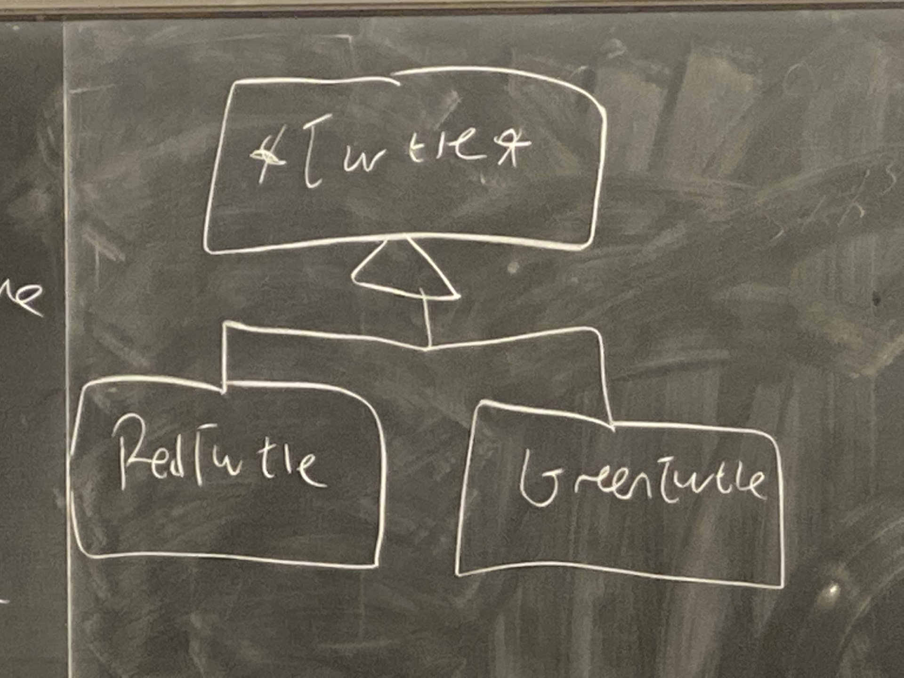
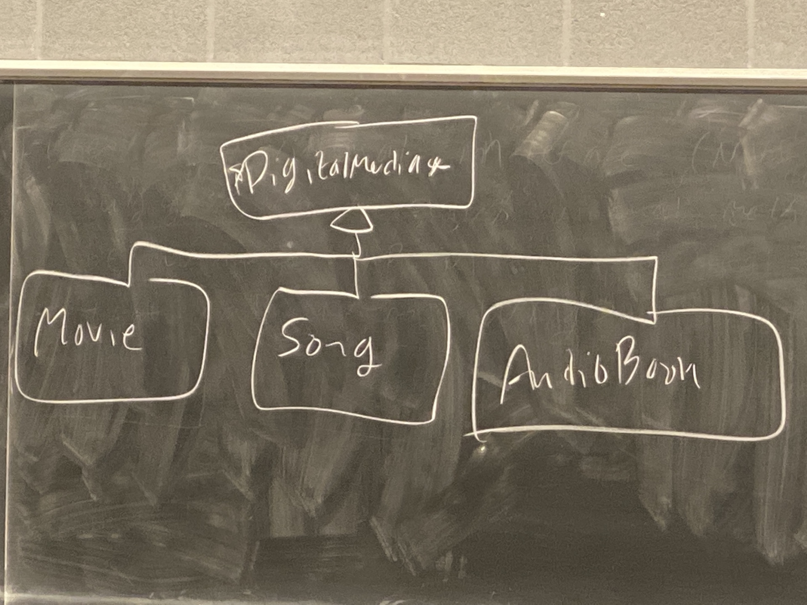

# Week 10 Lecture 2

## Problem: We want a function for which some behaviour can be specialized, but other behaviour remains the same

For example, we want to draw red and green turtles, but the head and feet should always be drawn the same. 

We have abstract base class Turtle. Inheriting from that are RedTurtle and GreenTurtle. 



```cpp
class Turtle {
    void drawHead() {...}
    void drawFeet() {...}
    public:
        void draw() {
            drawHead();
            drawShell();
            drawFeet();
        }

    private:
        virtual void drawShell() = 0;
};
```
**Note**: Virtual methods can be private
This means that the derived classes cannot call the base implementation. Something like `Turtle::drawShell()` isn't allowed

```cpp
class RedTurtle : public Turtle {
    void drawShell() override {
        // draws a red shell
    }
}

class GreenTurtle : public Turtle {
    void drawShell() override {
        // draws a green shell
    }
}
```

So now, all turtle's feet and head are drawn the same. Only the shell part can be specialized. This is the ***template method pattern***.

## Non Virtual Interface (NVI) Idiom
Suggests that all virtual methods should be wrapped up in non-virtual public wrappers that call them. 

### Why?
A public virtual method is really 2 things. 

1. An interface to the client because it is public
   - Promises some kind of behaviour, i.e. post conditions, class invariants, etc. 
2. An interface to the derived class because it is virtual
   - A hook for the derived classes to inject specialized behaviour

## How can the base class make a promise to the client when it doesn't control what code executes?

Eg. Digital Media



```cpp
class DigitalMedia {
    public:
        virtual void play() = 0;
}
```
Derived classes override that to play their various media types. Disney sues you since your software is not checking for digital rights management (DRM). Now, all `play` methods must check DRM before playing. 

Rather than adding the check to each derived classes `play` methods, if we follow NVI we can ensure `checkDRM()` is called in our non-virtual play method before dispatching to a virtual helper. 

```cpp
// translated to NVI
class DigitalMedia {
    virtual void doPlay() = 0;
    void checkDRM() {....}

    public:
        void play() {
            checkDRM();
            doPlay();
        }
}
```

This guarantees that **DRM** is always checked first regardless of what derived classes do. Saves us lots of duplicated code and passive mistakes. 

Regaining this control after the fact (if code has already been written) is much harder and more time consuming than using NVI from the beginning. 

**DO NVI FROM THE BEGINNING**

NVI is good to guarantee something that all derived classes must do. It's like the common portion for all derived classes. 

The NVI idiom states that 
- all public methods should be non-virtual
- all virtual methods should therefore be private or at least protected 
  - exception: **dtor**

## Another STL Class: Map - for creating dictionaries
```cpp
#include <map>
using namespace std;

map<string, int> phoneBook;
phoneBook["Abdur"] = 7224687;

cout << phoneBook["Abdur"] << endl; // 7224687
cout << phoneBook["Rob"] << endl; // 0
```

If key doesn't exist in the map and it is referenced, then the map creates it and default initializes the value. 

**NOTE**: Yes, integral (`int`) types have a default initializer, but, if we have `int n`, this would not be default initialized. This is uninitialized data. However, if we write something like `int x{}`, then it will be default initialized.

## If indexing the map adds a key, how do we check if a key exists? 
### Method 1 (Count)
```cpp
if (phoneBook.count("Brad")) {
    // count is 
    // 0 if it doesnt exist
    // 1 if it does exist
}
```

### Method 2 (Iterator)
```cpp
auto it = find(phoneBook.begin(), phoneBook.end(), "Brad");
if (it != phoneBook.end()) {
    // we found the key
}
```
Note that we also have the iterator to the key using this method

## Iterating over a map
```cpp
for (auto &p : phoneBook) {
    cout << p.first << " " << p.second << endl;
}
```
Note that we do `p.first` instead of `p.first()`. This is intended since `p.first` is just a member variable in the pair.

Type of P is `std::pair<string, int>`. `std::pair` is declared in `utility`.

Iterating over a map iterates in **sorted key order.** 

If you DON'T care about the order in which the map is iterated, use `unordered_map<T,P>` from header `unordered_map` because most of it's methods are **quicker**. 


