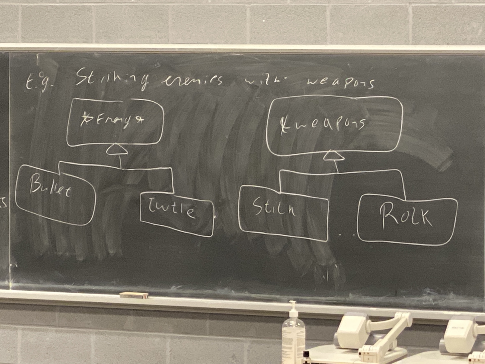

# Week 11 Lec 1

## Double Dispatch

We have 2 hierarchies and we have a function whose behaviour depends on both objects. 

Eg. Striking enemies with weapons. 

We have our enemy base class and our turtle class. We have different kinds of weapons. We have sticks and rocks. Striking an enemy with a weapon depends both on the weapon type and the enemy type. 



Striking an enemy with a weapon depends both on the weapon type and the enemy type.

```cpp
Enemy *e = ...;
Weapon *w = ...;

w->strike(*e); // enemies based on weapon, but not enemy
e->beStruckBy(*w); // chooses based on enemy, but not weapon
```

So if I have
```cpp
virtual void Enemy::beStruckBy(Weapon &w);
```
I choose only based on `Enemy` type.

If I have 
```cpp
virtual void Weapon::strike(Enemy &e);
```
Then vice versa.

What we want is something like 
```cpp
virtual void (Enemy, Weapon) strike()
```
But no such things exists sadly.

## Solution: Visitor Pattern
The key to this is combining **overrides** and **overloads**.

```cpp
class Weapon {
    public:
        virtual void strike(Enemy &) = 0;
}
```

Now we need to override this fn in both `Stick` and `Rock`.

```cpp
class Stick : public Weapon {
    public:
        void strike(Enemy &e) override {
            e.beStruckBy(*this);
        } // strike an enemy with a stick
}

class Rock : public Weapon {
    public:
        void strike(Enemy &e) override {
            e.beStruckBy(*this);
        } // strike an enemy with a rock
}
```

**Key Difference**: `*this` is different for both of these classes. We combined overloading and overriding in this. 

```cpp
class Enemy {
    pubic:
        void beStruckBy(Rock &) = 0;
        void beStruckBy(Stick &) = 0;
}
```

Now we can write class `Turtle`

```cpp
class Turtle : public Enemy {
    public:
        void beStruckBy(Stick &s) override {
            // code to strike a turtle with a stick
            ...
        }
        void beStruckBy(Rock &r) override {
            // code to strike a turtle with a rock
            ...
        }
}
```

Now, class `Bullet` will be similar (write this on your own)
```cpp
Enemy *e = new Bullet{...};
Weapon *w = new Stick{...};
w->strike(*e);
```

- virtual dispatch calls `Stick::strike()`
- `Stick::strike()` calls `e.beStruckBy(*this)` 
  - `*this` is a `Stick` ptr. So virtual dispatch is done on the `beStruckBy(Stick &)` method.
- Virtual dispatch chooses `Bullet::struckBy(Stick &)` and that runs the code for striking a bullet with a stick.

## Visitor Pattern Described
The visitor pattern can be used to add additional functionality to the hierarchy without changing it itself. 

```cpp
class Book { // analogous to weapons
    public:
        ...
        virtual void accept(BookVisitor &bv) {
            bv.visit(*this); // analogous to strike
        }
};

class Comic : public Book {
    public:
        void accept(BookVisitor &bv) {
            bv.visit(*this); // difference here is that this is a pointer to a comi
        }
}

class Text : public Book {
    public:
        void accept(BookVisitor &bv) {
            bv.visit(*this); // difference here is that this is a pointer to a text
        }
}
```

Now we can write our `BookVisitor` class

```cpp
class BookVisitor {
    public:
        virtual void visit(Book &b) = 0;
        virtual void visit(Comic &c) = 0;
        virtual void visit(Text &t) = 0;
}
```
Now let's say we have a vector of `Book` pointers. **We want to work polymorphically**. 

```cpp
struct Catalogue : public BookVisitor {
    map<string, int> theCatalogue;

    void visit(Book &b) {
        ++theCatalogue[b.getAuthor()];
    }

    void visit(Text &t) {
        ++theCatalogue[t.getTopic()];
    }

    void visit(Comic &c) {
        ++theCatalogue[c.getHero()];
    }
}
```
This is why we wanted the **visitor pattern**. 

## Measures of **Design Quality**

### ***Coupling***
- How tightly intermingled the modules are
- How much one class relies on the details of another

**Higher Coupling** - Classes access and use private data within each other. 

**High Coupling** - Classes communicate through mutating global variables

**Low Coupling** - Classes communicate back and forth with specific specialized types.

**Lower Coupling** - Classes interact through the pubilc interfaces of each other with functions that consume and return basic data

We want **lower coupling**. 

**Visitor pattern** is inherently tightly coupled. We are making trade-offs by using it.

### ***Cohesion***
- Degree to which the contents of a module *belong* together

**Lower Cohesion** - Collection of random classes and functions together.
Eg. Putting everything in one file.

**Low Cohesion** - Collection of assorted classes and functions with a common theme, and maybe some common code. Eg. `Algorithm` library

**High Cohesion** - Classes work toogether in order to provide various behaviours. (Example - module with data class and display class)

**Highest Cohesion** - Contents of module (classes/fns) work together to achieve a single task. Eg. `Vector` class

We want **higher cohesion**.

## Casting in C++
Casting is usually the **wrong** thing to do. It is usually indicative of a design flaw. *But*, if we must cast, use `C++` casts, not `C` casts. This is because they are safer.

`static_cast` for meaningful casts with well defined conversions. Eg. int to float

```cpp
int x = 5;
float f = static_cast<float>(x);
```

`const_cast` to cast away the const-ness. 

**Application**: Consider you are using a library and that library offers some function that takes a pointer to an `int`. We have a pointer to a `const int`. That function did not declare that it is taking in a `const int`, but we know the function **doesn't actually change the integer**. In this case, we use `const_cast` to call the function.

```cpp
void Foo (A &a) {
    // doesn't actually mutate a
}

...

const A a {...};
Foo(const_cast<A&>(a));
```

`reinterpret_cast` - for not well defined *weird casts*. Almost all usages of `reinterpret_cast` lead to undefined behaviour. Basically telling the compiler "trust me". 

  


