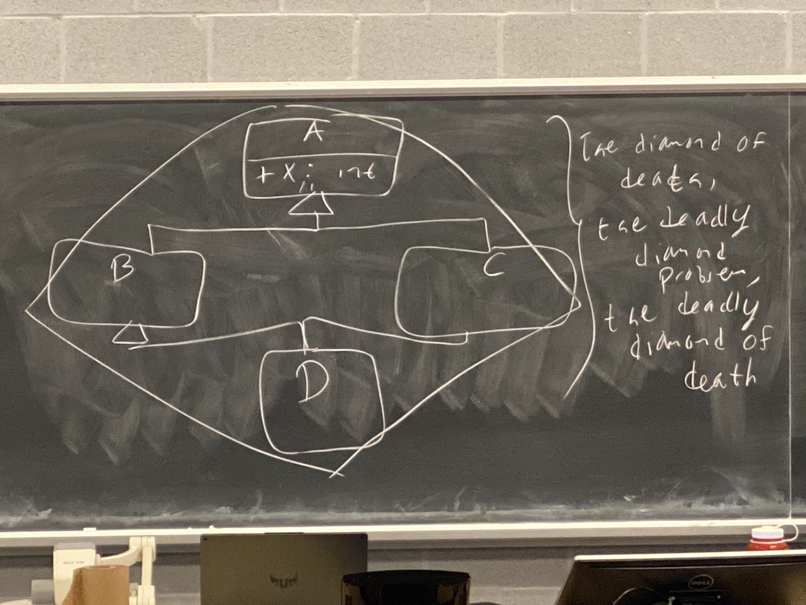

# Week 11 Lecture 2

## Dynamic Cast

***Casting from base class to derived***

Is for casting from base class pointers/references to derived class ptrs/refs. Effectively allows us to find out what a base class pointer actually points at. 

**Behaviour**: Dynamic cast on a pointer returns the `nullptr` if that ptr doesn't actually point at that object. If it does, it returns back the ptr itself. 

For eg.
```cpp
AbstractBook *p = new Comic{...};
...
Text *q = dynamic_cast<Text *>(p);
// q is the nullptr since p isn't a text

Comic *c = dynamic_cast<Comic *>(p);
// c is the ptr p, but now it is of type Comic
```

We should avoid this because consider the following example

```cpp
void F(AbstractBook *p) {
    if (dynamic_cast<Comic *>(p)) {
        cout << "Comic" << endl;
    } else if (dynamic_cast<Book *>(p)) {
        cout << "Regular Book" << endl;
    } else if (dynamic_cast<Text *>(p)) {
        cout << "Text" << endl;
    }
}
```

Code like `F` is highly coupled to the `Book` hierarchy. Also, it defeats the purpose of inheritance and polymorphism altogether. We're **meant** to not care what these things point at and work through the abstract interface polymorphically. 

In general, most uses of `dynamic_cast` indicate a flawed design and are a bad code smell.

## Back to the polymorphic assignment problem
If for some reason we really want/need to allow polymorphic assignment, it's now possible with `dynamic_cast`. 

```cpp
class AbstractBook {
    public:
        virtual AbstractBook& operator=(const AbstractBook& b) {
            author = b.author;
            title = b.title;
            numPages = b.numPages;
            return *this;
        }
}
```

```cpp
class Comic : public AbstractBook {
    ...
    public:
        const &operator=(const AbstractBook& o) override {
            const Comic &c = dynamic_cast<const Comic&>(o);
            // Theres an exception if O doesn't actually refer to the comic object

            AbstractBook::operator=(o);
            hero = c.hero;
            return *this;
        }
}
```

Still, the recommendation hasn't changed. 99% of the time assignment through base class pointers/refs doesn't make sense. But, if you must do it, this is how to do it. 

## Casting for Pointers
All of these casts have smart ptr variants, so if you must do this on smart ptrs, use `dynamic_pointer_cast` and `static_pointer_cast`. These are defined in the `<memory>` header. 

## Multiple Inheritance
Our Abstract Base Classes (ABC) represent common interfaces that types share. However, they also encapsulate common data and common code. Because of this, it's not abnormal to have classes that inherit from more than one ABC. 

For example.
```cpp
// something that can be drawn on the screen
class Drawable { 
    ...
    public:
        virtual void draw(int x, int y) = 0;
};

// things controllable through input
class Controllable {
    ...
    public:
        virtual void handleInput(InputEvent &e) = 0;
};
```

Some things are drawable like enemies. But some things that are drawable are also controllable. Our player character is both drawable and controllable.

```cpp
class PlayerCharacter : public Drawable, public Controllable {
    ...
    public:
        void draw(int x, int y) override {...}
        void handleEvent(InputEvent &e) override {...}
}
```
**Our class inherits from 2 different abstract base classes.**

This is called **Multiple Inheritance**. It is fine and allowed by C++, BUT there are problems. So, for example, 



We have class A, and A has a public x field that is an int. Inheriting from that we have B and C. Inheriting from B and C, we have D. The problem with this is the **diamond of death**, **the deadly diamond problem**, **the deadly diamond of death**. We have a diamond.

```cpp
D dObj;
dObj.x = 10; 
// this is an error. if it wasn't an error, it would be ambiguous. 
// D has 2 x fields. 1 from B and 1 from C. 
// If we try to print out dObj.x, which object's x should get printed out?
```

We must say

```cpp
D dObj;
dObj.B::x = 10;
dObj.C::x = 10;
```

### Is this what we really want though? Do we want to maintain 2 `x` fields?
Probably not.

**Solution**: ***Virtual Inheritance***

```cpp
class A {
    public:
        int x;
};

class B : public virtual A {
    ...
};

class C : public virtual A {
    ...
};

class D : public virtual B, public virtual C {
    ...
}
```

Now, `D` has only 1 `x` fields, the one inherited from it's ancestor `A`. 


