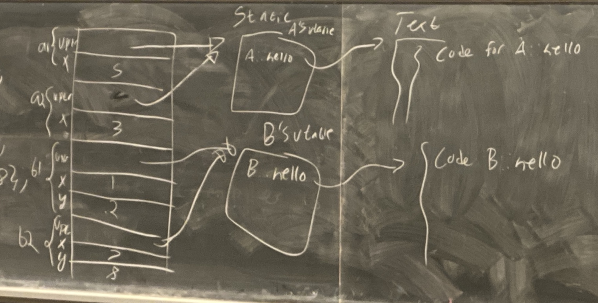

# Week 5 Lecture 2

The inclusion of virtual functions made our objects 8 bytes (size of a pointer) larger. That is because at the beginning of the first 8 bytes of these objects, the compiler is storing a pointer called the `vpointer` or the **virtual table ptr** . 

It points at the *virtual function table/vtable* for the class that object's type. 

For ex.

```cpp
class A {
    int x;
    public:
        virtual void hello() {
            cout << "I'm an A";
        }
}

class B : public A {
    int y;
    public:
        void hello() {
            cout << "I'm a B";
        }
}

int main() {
    A a1{5};
    A a2{3};
    B b1{1,3};
    B b2{7,8};
}
```




