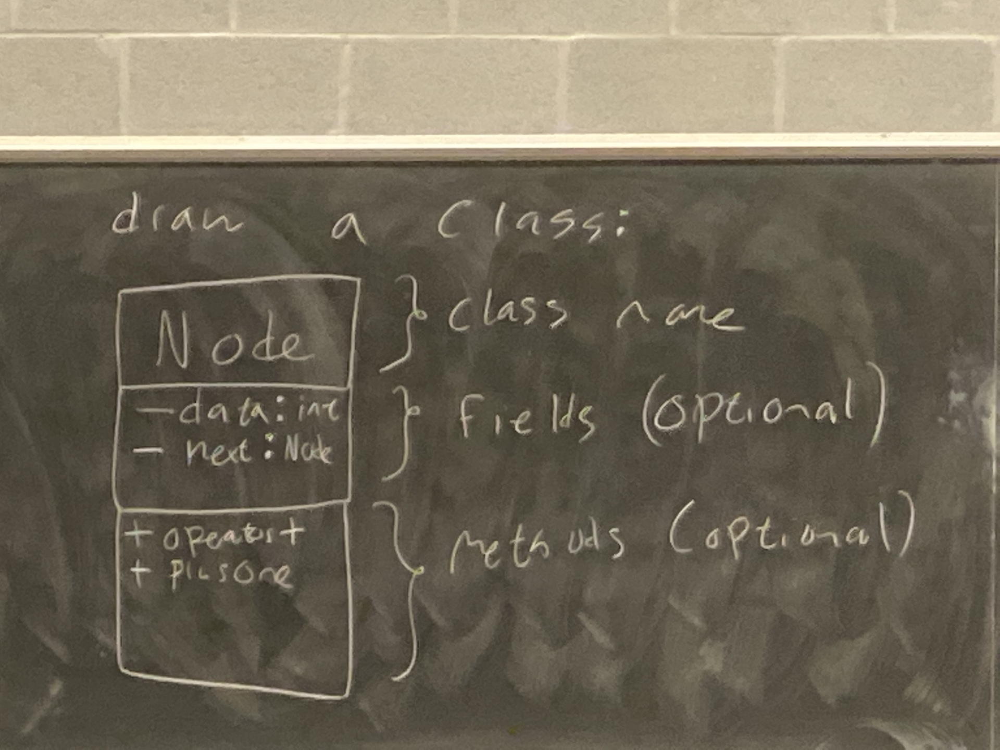

# Week 6 Lecture 1

```cpp
class Book {
    string title, author, field;
    public:
        Book &operator= (const Book &o) ...
}
```

```cpp
class Comic: public Book {
    string hero;

    public:
        Comic &opeartor=(const Comic &other) {
            Book::operator=(other);
            hero = other.hero;
        }
}
```

## CAO

```cpp
// text is similar
void copyFirst (Book **lib, int size) {
    for (int i=1; i<size; ++i) {
        *lib[i] = *lib[o]
    }
}
```

So the CAO for Book isn't virtual, so this only calls `Book`'s assignment operator. So each object gets its `Book` fields assigned. But not it's `Comic` or `Text` fields if it one such object - this is partial assignment. 

### Solution 1 (Doesn't work) Make it virtual

```cpp
class Book {
    string title, author, field;
    public:
        virtual Book &operator= (const Book &o) ...
}
```

```cpp
class Comic: public Book {
    string hero;

    public:
        Comic &opeartor=(const Comic &other) override {
            Book::operator=(other);
            hero = other.hero;
        }
}
```

When I add the override keyword to `Comic`'s (and Text's) CAO, I get cold. You asked it to override a function, but no matching virtual function exists in the base class.

In order to override `Book`'s CAO, `Text` and `Comic`'s constructors must take `Book` & params (types of the function must match). If I do that, I can't access the `hero`/`topic` field of other, because it is a `Book &`.

Let's assume that I could write these CAO's. If I can, what happens when I do this?

```cpp
Book *pt = new Text{...};
Book *pc = new Comic{...};


*pc = *pt;
// What happens then?
```
### Mixed Assignment
If the CAO is virtual, then mixed assignment is allowed because `Comic`, `Book`, and `Text` are all `Book`'s. They all match the CAO parameters. 

We get **partial assignment** through base class pointers if CAO is non virtual, and **mixed assignment** if it is. The problem is tha assignment through *base class pointers* doesn't really make sense. 

It doesn't make sense because we never know if those two pointers actually point to the same type. 

**Sol'n**: Just don't do it lol

Disallow assignment through base class pointers. 

**How to do this?**

Make base class assignment operator protected.

```cpp
class Book {
    protected:
        Book &operator=(const Book & o) ...
    public:
        ...
}
```

```cpp
class Comic {
    ...
    public:
        const &operaotr=(const Comic &o) {
            Book::operator = (o);
            hero = o.hero;
            return *this;
        }
}
```

```cpp
void copyFirst(Book **lib, int size) {
    for (int i=1; i<size; ++i) {
        *lib[i] = *lib[o]
    }
    // THIS IS NO LONGER VALID, AS WANTED
}
```

So the following is no longer valid. `Book`'s CAO is protected
```cpp
Book b{457, "Spin", "Robert"};
Book a{320, "Annihilation", "..."};
a = b;
```

## New idiom (Abstract class)
Our preference is that all base classes be abstract. An abstract class is a class that cannot be instantiated. **How to make this?**

An abstract class in C++ is any class with at least 1 **pure virtual method.** A pure virtual method is a method that does not require an implementation. 

For example.
```cpp
class RegularStudent : public Student {
    public:
        int fees() {
            return 2500 + 500 * numCourses; // as before
        }
}

class CoOpStudent : public Student {
    public:
        int fees() {
            return 4500 + 500 * numCourses;
        }
}

class Student {
    const **arr;
    int numCourses;
    public:
        // pure virtual method. Doesn't need to have an implementation since a student is either a coop student or a regular student.
        virtual int fees() = 0;

        // = 0 states this function is pure virtual. It does not require an implementation (you can still give it one). We don't give it one since it doesn't make sense for us to give it one.        
}
```
Since Student has a pure virtual student, it is an abstract class.

```cpp
Student S{...};
// not valid, can't instantiate objects of an abstract type
```

*Back to Book* \
We now made an abstract book type.

```cpp
class AbstractBook {
    int numPages;
    string title, author;

    protected:
        Abstract Book & operator= (const AbstractBook & other);
    public:
        ...
        virtual ~AbstractBook = 0;
        // we cannot leave this destructor unimplemented
}
```

`~AbstractBook` still needs an implementation because the 4 phases of object destruction are

1. dtor body runs
2. dtor for fields which are objects run
3. base class dtors run
4. space is deallocated

If the dtor isn't implemented, we get a linker error. So IMPLEMENT IT.

```cpp
AbstractBook::~AbstractBook() {}
```

### Polymorphic assignment problem

```cpp
class RegularBook : public AbstractBook {
    public:
        RegularBook &operator(const RegularBook &);
};

// comic and Text are similar
```

Now, assignment through base class pointers is no longer allowed. But assignment of our individual `Book` objects (`RegularBook`, `Comics`, and `Text`) is allowed.

**Note:** Non-abstract classes are called **concrete classes**. 

## Making dtor pure virtual
If we have no methods to make `pure virtual`, we choose to make the destructor `pure virtual`. The reason for this is that a class with inheritance should always have a virtual destructor.

*Why?*

Consider the following -

```cpp
class One {
    int *p;
    public:
        One(int n) : p{new int{n}} {}
        ~One() {delete p;}
        // the dtor is not virtual
}

class Two : public One{
    int *x;
    public:
        Two(int o, int t) : One{o}, x{new int{t}} {}
        ~Two() {delete x;}
}


int main() {
    One *arr[3];
    arr[0] = new One{5};
    arr[1] = new Two{3, 7};
    arr[2] = new Two{4, 5};
    for (int i=0; i<3; ++i) {
        delete arr[i]
    }
}
```
Memory is lost with the above destructor implementation. `One`'s destructor is called for every destructor, so `Two`'s `int* x` is not deallocated. 

Since the dtor is not virtual, virtual dispatch doesn't happen. Only `One`'s dtor is called and we leak all `Two::x` fields. If you have inheritance, declare your dtor's virtual.

## System Modelling
Software systems can grow large and complex. It's not always feasible that all programmers working on a project know every single module. 

Model's can be an effective way of communicating the structure of a software system. We look at **UML class diagrams**. 

## UML Class Diagrams
How to draw a class?

1. Put the name of the class in a box
2. Fill in fields underneath
3. Add functions underneath
   1. Don't add CAO, MAO, etc. Those always exist
   2. Add operator+
   3. 





