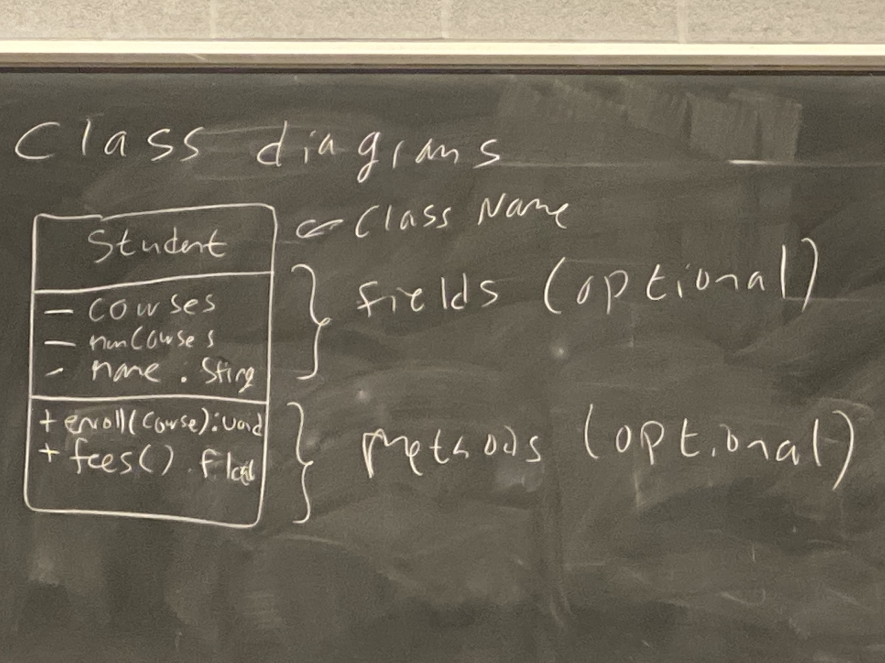
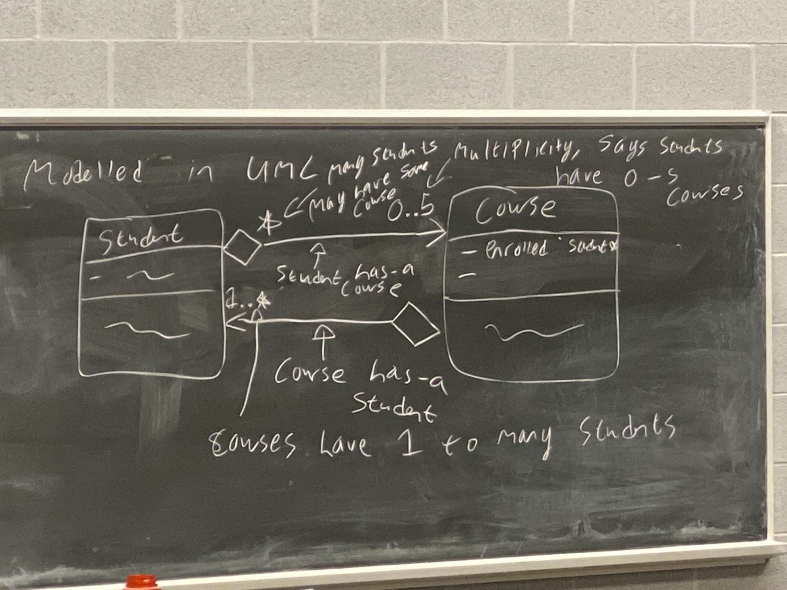
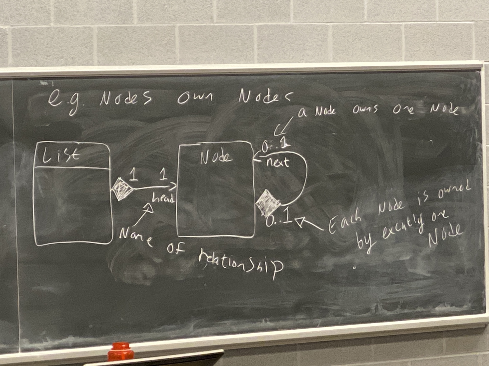
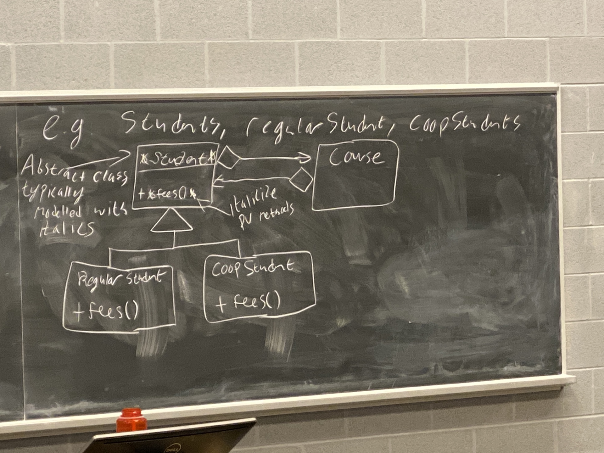
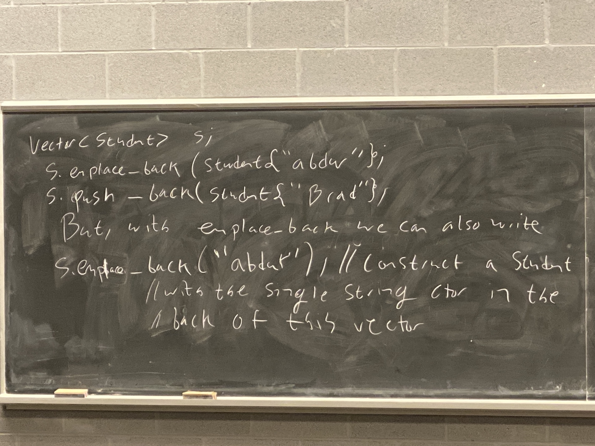

# Week 6 Lecture 2

## UML Class Diagrams

We had class Student with its variables and its functions. Return types are next to the identifiers and the functions.



Whether or not to include fields/methods (or in fact which fields/methods to include) is a decision which depends on the intended use of the diagram. We should consider

1. Who is the audience?
2. What are they using the diagram for?

## Private vs. Public vs. Protected Methods 
The hyphen (-) before fields/methods indicate that member is **private**.

The plus(+) before fields/methods indicate that member is **public**

The asterisk(*) before fields/methods indicate that member is **protected**

## Relationship types (Aggregation)
When an object has another object (typically through a ptr or ref). But that object is not *owned*.

If an object of type A "has-a" object of type B, then typically 
- B has an existence outside of A
- If A is copied, then B is not (shallow copy)
- If A is destroyed, then B is not

For eg.
`Course`'s have `Student`'s and also `Student`'s have `Course`'s

### How to represent this in UML
Use a diamond arrow to show `Student` has `Course`'s and `Course` has `Student`. We can put **multiplicities** at the end of these to show how many of these objects we might have. For eg. `Student` is enrolled in max 5 courses.

**Multiplicities** - Asterisk means 0 to many

It doesn't make sense for course to have 0 students, so we can change.

Also many students may have each course - we don't have max limit on that.



**Aggregations** (also called a "has-a" relationship) is remodelled in UML with a non-filled in diamond as above.

## Relationship Composition (owns-a)
Composition relationship is when an object is composed of another (typically through containing a field or that type, or an owning ptr)

Typically, if A owns-a B then
- B has no existence outside of A
- If A is copied, then B is copied
- if A is destroyed, then B is destroyed as well

For eg. `Node`'s own `Node`'s



Multiplicities and names of relationships are optional (like fields and methods) but can be helpful.

## Relationship Specialization (is-a)
A B is-an A if
- everything you can do to an A, you can do to a B

### Lizkov substitutability principle
a B is only an A if it is substitutable in all situations for an A.

Typically implemented through inheritance.

For eg. `Student`'s, `RegularStudent`'s, `CoOpStudent`'s

We draw this with a triangle. Special thing about `Student` was that it was abstract. We model abstract classes with *italics*.

**Tip**: Italicize pure virtual methods



## The Vector Class

```cpp
#include <vector>

int main() {
    vector<int> v; // get an empty vector
    vector<int> m{5,4}; // get vector containing [5,4]
    vector<int> l(5,4); // get vector containing [4,4,4,4,4]
}
```

**Note**: Here there is a difference between curly braceas and parentheses, however only noticable when `int` type.

Eg. 
```cpp
vector<string> t(3, "Hello");
// vector that contains 3 "Hello"
```

## Curly braces
Curly braces here take a list of elements you want in your vector. Some vector operations -

We can add things to the end of a vector with `vector::emplace_back()`. 

```cpp
vector<int> v;
for (int i=0; i<20; i++) {
    v.emplace_back(i);
}
```

### push_back vs emplace_back


Vectors can be indexed like an array.

```cpp
vector<int> v{1,2,3,4};
v[0] = 20; // v is now 20, 2, 3, 4
```

Vectors also have ***iterators***.

```cpp
for (auto &x:v) {
    ++x; // increment each thing in the vector
}
```
## Iterator Invalidation
**Beware**: 

```cpp
void copy_and_change(vector<int> &v, int x) {
    auto it = v.begin();
    for (; it!=v.end() && *it != x; ++it);
    // make x copies of this number in v, and then change the original to 0
    for (int y=0; y<x; ++y) {
        v.emplace_back(x);
    }
    *it = 0;
} 
```

It is an iterator of the vector, it stores a ptr to the values array, as we were addign things to the vector. It's array got full, it had to allocate a new array. So the ptr in our `it` was dangling.

The problem above is called **iterator invalidation**. You need to be aware of it to use a vector, documentation for vector methods will tell you if that method may invalidate iterators. So be aware of it when using vectors and iterators.


