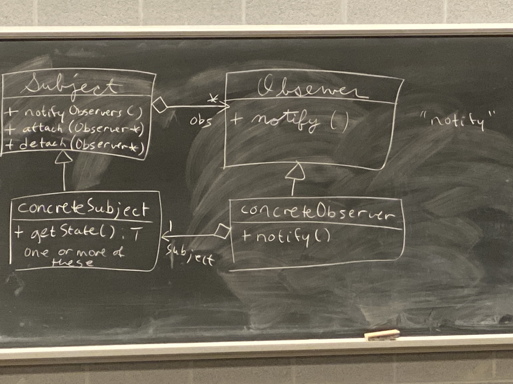

# Week 7 Lecture 1

## Vectors (Continued)
`vector` manages the array that it's built on, but not it's contents.

```cpp
class Foo {
    int* p;
    public:
        Foo() : p{new int} {}
        ~Foo() { delete p }
}

int main() {
    vector <Foo> vf;
    vf.emplace_back();
    vf.emplace_back();
}
```

When `vf` goes out of scope, the vector dtor deletes the array. `Foo`'s dtor runs, and no memory is leaked.

## Caution (Leaked memory for int*)
```cpp
int main() {
    vector <int *> vp;
    vp.emplace_back(new int {1});
    vp.emplace_back(new int {2});
}
```

`vp` goes out of scope, so vector deletes the array. The two int's here are leaked since they do not have a dtor. To fix this, we have to **manually** delete the pointers. 

## Observer Design Pattern
For a ***Publisher Subscribe Model***
- One Publisher/Subject class that generates data
- One or more Subscriber/Observer class that receives data + reacts to it

**Example:** \
Publisher: spreadsheet cells \
Observer: graphs 

When the cells change, the graph's update themselves.

Basically observer just updates based on what the publisher does.

**Example:** \
Publisher: react code
Observer: web browser 

Data itself does not care what we do in reaction. It just knows that we are interested in it. Subject does not need to know all the details about them. 

## UML Observer Design Pattern
*italics* means abstract class



Subject is aware that it has observers by the names of it's functions. We do not know how many, that is arbitrary. 

Notice that it is an **open tail arrow**- this means it has them, but it doesn't own them. 

Only thing that characterizes `observer` is `notify`. It lets you know that people are watching you. 

Inheriting from these classes are our concrete observer + publisher classes.

The concrete subject will need a `getState()` method so the observer can see exactly what happened. The concrete observer will have a concrete definition of what they will do for `notify`. 

**Note:** `concreteSubject` and `concreteObserver` are not italicized

## Sequence of method calls
1) `Subject`'s state is updated
2) `Subject::notifyObservers()` is called (by `Subject` or by an external controller)
3) `Subject::notifyObservers()` calls `notify()` on each of `Subject`'s observers
4) Each `Observer` calls `concreteSubject::getState()` to create a state and then react accordingly

## Implementation of Publisher Subscriber Design Pattern
Horse Races Example:
- The subject publishes winners
- Observers are the people betting on the horses
  - Their reaction will either be victory or sorrow based on who won

```cpp
class Subject {
    vector<Observer*> observers;
   public:
    void attach (Observer* o) { observers.emplace_back(o) };
    void detach (Observer* o) { ... }
    void notifyObservers() {
        for (auto ob: observers) ob -> notify();
    }
    // make the destructor pure virtual (last possible option)
    // purely to make the class abstract
    // need to define the destructor body due to order of dtor calls
    virtual ~Subject() = 0;
}

// give this implementation (NEED TO DO THIS)
Subject::~Subject() {}

class Observer {
   public:
    virtual void notify() = 0;
    virtual ~Observer() {}
}
```

**The concrete classes**
```cpp
class HorseRace : public Subject {
    ifstream in;
    string lastWinner;
   public:
    HorseRace(const string &source) : in{source} {}
    // boolean returns true if there are values in the file
    bool runRace() {istream in >> lastWinner;}
    // the const means it does not modify any state
    string getState() const { return lastWinner; }
}

class Better : public Observer {
    HorseRace *subject; // non ownership situation
    string name, nameHorse;
   public:
    // constructor for better
    // one thing it does other than setting 3 fields is attach itself to subject
    Better(...) {
        ...
        subject->attach(this);
    }

    void notify() override {
        string winner = subject->getState();
        cout << (winner == myHorse? "Win!" : "Lose :=(") << endl;
    }

    // detach itself after destructing
    virtual ~Better() {
        subject->detach(this);
    }
}

int main() {
    HorseRace hr {"source.txt"};
    Better Larry {&hr, "Larry", "runsLikeACow"};
    // after betters
    while (hr->runRace()) {
        hr.notifyObservers();
    }
}
```

## Exceptions - Back to CAO
```cpp
Node &operator=(const Node &other) {
    if (this == &other) return *this;
    delete next;
    data = other.data;
    next = other.next ? new Node {*other.next} : nullptr;
    return *this;
}
```

### What if new fails?
An exception is raised

### Why might new fail?
If there is not enough free memory left to satisfy the request.


