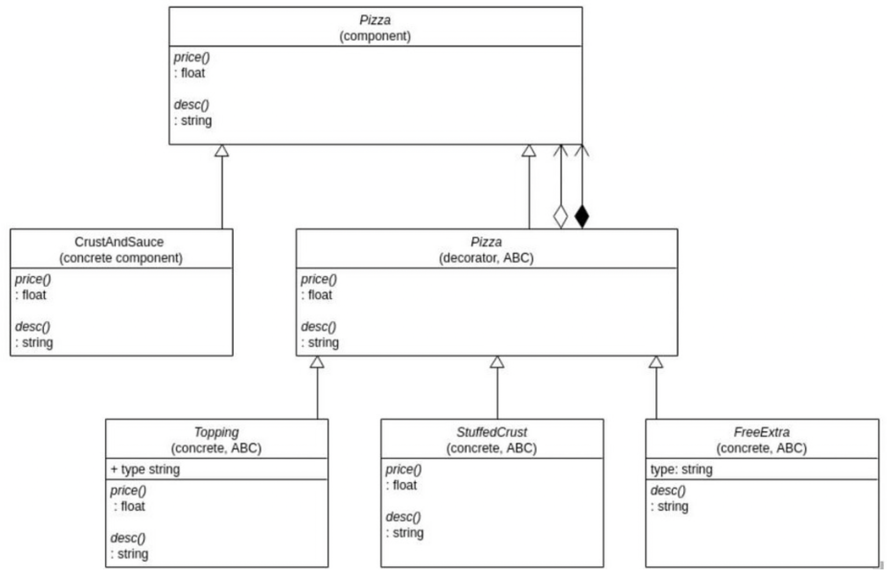

# Week 8 Lecture 2

## Decorator Pattern
**Problem** - We want an object hierarchy where at runtime we can mutate the behaviour of the relevant functions provided by that hierarchy.

**Solution** - Decorator Pattern

Example: Lets say we want to create a pizza ordering system where users can add/remove things from the pizza, changing the `price` and `description`. Assume we *need* to implement the following UML diagram. 



First we can create the `Pizza` and `CrustAndSauce` classes:
```cpp
class Pizza {
    public:
        virtual float price() = 0;
        virtual string desc() = 0;
        virtual ~pizza(){};
}

class CrustAndSauce : public Pizza {
    public:
        float price() override { return 5.40; }
        string desc() override { return "Pizza"; }
}
``` 

With this, we can create a basic pizza using
```cpp
Pizza * p = new CrustAndSauce{};
```

## Why did we make an abstract pizza class and then inherit?
Why did we inherit instead of just having one class? Although this doesn't make sense in isolation, it'll be useful when we introduce the `Decorator`.

## How to add modifications?
2 Options -
1. Have `Pizza` own the decorators. Thus, whenthe Pizza is destroyed, so are the toppings. (filled in diamond)
2. Use a *has-a* relation instead. Even if the `Pizza` is destroyed, toppings will exist (not filled in diamond)

Lets use the option 1 (*owns-a* relation) since it makes more sense.

```cpp
class Decorator : public Pizza {
    Pizza *p;
    public:
        Decorator(Pizza *p) : p{p};

        float price() override { return p->price(); }
        string desc() override { return p->desc(); }

        ~Decorator() = 0 { delete p; }
}
```
`Decorator` inherits from `Pizza`, and `Decorator` also owns a `Pizza`. We can now create nested modifications. 

Now let's create the `Topping` class, overriding the `price` and `desc` functions.

```cpp
class Topping : public Decorator {
    string top;
    public:
        Topping(string top, Pizza *p) : Decorator{p}, top{top} {}

        float price() override {
            return 1.00 + Decorator::price();
        }

        string desc() override {
            return Decorator::desc() + " with " + top;
        }
}
```

Client Code:
```cpp
int main() {
    Pizza *p = new FreeExtra{"A well done",
                new Topping{"basil", 
                    new Topping{"pineapple",
                        new Topping{"ham",
                            new StuffedCrust{new CrustAndSauce}}}}};
    cout << p->desc() << endl;
}
```

Notice that the top most Decorator is `FreeExtra{"A well done", ...}`. Additionally, this contains a child `Pizza`, in this case being `Topping{"basil", ...}`. This is why we have `Decorator` own a `Pizza`. It lets us chain together modifications very easily. 

